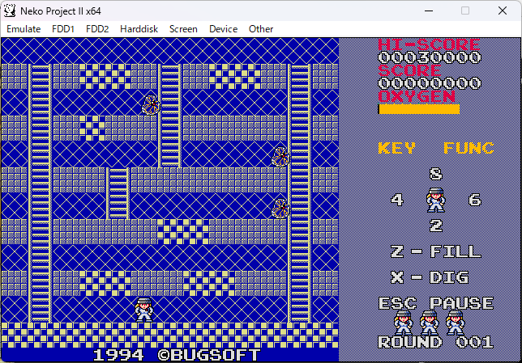
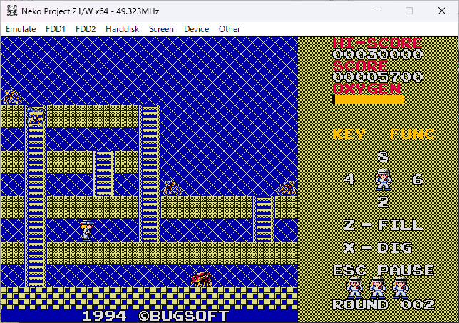

# Space Panicco Archive

Historical archive of the PC-98 action game  
**Space Panicco (すぺーす ぱにっ娘)**.

Originally released in **1994**.

This repository was created by one of **the original authors**.

This repository preserves the original distributed files, documentation,
and disk images of the game for historical and archival purposes.

---

## Screenshots

| Round 1 | Round 2 |
|--------|--------|
|  |  |
| Neko Project II x64<br>MS-DOS 3.30 | Neko Project 21/W x64<br>MS-DOS 6.20 |

Screenshots showing the game running on two different PC-98 emulator environments.

---

## About the Game

Space Panicco is a **platform action game inspired by Space Panic**.

The title is a play on the arcade game *Space Panic*.  
The heroine of the game is named **Panicco (ぱにっ娘)**.

The player controls the heroine **Panicco**, digs holes in platforms,
and defeats aliens by dropping or burying them.

Unlike the original *Space Panic*, this game introduces additional mechanics:

- enemies require different falling heights to defeat
- unbreakable floors allow **bury-kill strategies**
- chain drops and enemy collisions
- editable stage maps
- configurable gameplay parameters

These features make Space Panicco a more strategic evolution of
the classic digging-platform formula.

---

## Game Credits

Program  
**Geimu Shokunin (芸夢職人)**

Music & Graphics  
**Motoi Kenkichi (基 建吉)**

Released  
**1994-09-20**

The game was developed by the Japanese doujin software circle  
**BUGSOFT**.

## Third-Party Components

This program appears to have been built with several third-party components,
as indicated by strings found in the original binary.

### Compiler
* Borland Turbo C  
  Copyright (c) 1987–1988 Borland International

### BGM Library
* BGM Library ver1.12  
  Copyright (c) 1989–1993 Fumitake Yodo (淀文武) / STUDIO FEMY

### Utility Library
* master.lib Version 0.21  
  Copyright (c) 1993 Akihiko Koizuka (戀塚昭彦), Kazumi

---

These components are preserved as part of the original software environment.  
For details of the investigation, see:

analysis/licensing-investigation-en.md

---

The above components are identified based on strings found in the original executable
and related documentation.  
All rights belong to their respective authors.

---

## Distribution History

This work was released in **1994** through Japanese hobbyist software distribution channels.

It was initially distributed via **bulletin board systems (BBS)** on Japanese PC communication networks.

It was also distributed at events such as **Comic Market (Comiket)**, where it was provided on floppy disks together with a simple printed manual.

Later, it became available through online distribution, including the **Vector Software Library**.

Today, it is preserved and published on **GitHub (since 2026)** as part of a historical archive project of PC-98 doujin games.

---

## Internet Archive

A permanent snapshot of this archive is preserved on Internet Archive:

https://archive.org/details/space-panicco-archive-main

This ensures long-term preservation of the project even if the GitHub
repository changes in the future.

---

## Repository Structure

```
Space-Panicco-Archive

original/
    panic24.zip          Original distribution archive
    panic24.hdm          Floppy disk image

environment/
    fd98_2hd_p24.img     Bootable FreeDOS(98) floppy image

extracted/
    Extracted original files from the archive

docs/
    original_manual.md      Original Japanese manual
    manual_en.md            English translation
    Running-the-Game.md     Detailed instructions (English)
    Running-the-Game_ja.md  Detailed instructions (Japanese)

screenshots/
    Emulator screenshots
```

---

## Original Distribution

The original distribution of **Space Panicco v2.4** was archived from:

Vector software library

https://www.vector.co.jp/soft/dos/game/se023653.html

The files included in this repository preserve the original
distribution archive and floppy disk image for historical purposes.

Additional disk images may be provided for convenience to help run the
software in modern emulator environments.

---

## System Requirements

The game was originally developed for the **NEC PC-9800 series**
personal computers.

### Original Hardware

- NEC PC-9801 / PC-9821 series
- MS-DOS
- Internal PC speaker (BEEP)
- Floppy disk drive

FM sound hardware is **not required**, as the game uses the internal
speaker.

---

## Emulator

The game can be played on PC-98 emulators such as:

- Neko Project II
- Neko Project 21/W
- T98-Next
- Anex86

---

## Verified Environments

| Emulator | DOS Version |
|--------|--------|
| Neko Project II x64 | MS-DOS 3.30 |
| Neko Project 21/W x64 | MS-DOS 6.20 |

---

## Running the Game

Space Panicco was originally designed for **NEC PC-9801 series computers running MS-DOS**.

Today the game can be played using a **PC-98 emulator**.

The archive includes two ways to run the game.

### Floppy Disk Image

```
original/panic24.hdm
```

Mount the disk image in a PC-98 emulator and start the game from DOS:

```
PANIC
```

### FreeDOS Boot Disk

```
environment/fd98_2hd_p24.img
```

This bootable image automatically starts **Space Panicco**.

For detailed instructions, controls, and compatibility notes see:

```
docs/Running-the-Game.md
```

Japanese instructions are available here:

```
docs/Running-the-Game_ja.md
```

---

## Disk Image Format

The primary floppy disk image preserved in this archive is:

```
original/panic24.hdm
```

D88 format was also tested, but the available converted image showed
compatibility problems in some emulators and mounting tools.

For reliability, the HDM image is therefore used as the preserved
disk image for this archive.

---

## Audio System


This program uses the **internal PC-9801 buzzer** for sound output.

Music playback may involve components related to **BIO_100%**.

Details are currently under investigation, and the system produces pseudo-polyphonic sound through software-based techniques.

### Related resources (context)

- https://github.com/koizuka/master.lib  
  A comprehensive PC-98 MS-DOS library (1993–1995) for graphics, sound, and I/O.  
  This project is not directly related to Space Panicco, but is provided as a reference for typical development practices of the era.

Music data is stored in:

```
PANIC.BGM
```

The main BGM **"Bottakuri Shouten" (ボッタクリショウテン)**  
was composed by Kenkichi Motoi on **1994-05-11**.

This music was originally written using the **PLAY3 buzzer music
driver** for the **SHARP PC-E500** pocket computer.

https://github.com/gikonekos/PLAY3-Archive

---

## Stage Data

Stage layouts are stored as text-based map files:

```
VMAP001.DAT – VMAP032.DAT
```

Map size:

```
13 × 12 blocks
```

---

## Documentation

```
docs/original_manual.md
docs/manual_en.md
docs/Running-the-Game.md
docs/Running-the-Game_ja.md
```

---

## Contact

Motoi Kenkichi  
https://x.com/qptn/

Geimu Shokunin  
https://x.com/k2PSyIqxDKciBXA

You may also open an **Issue** in this repository.

---

## Acknowledgements

Some documentation editing and English text polishing
were assisted by ChatGPT during the archive preparation.

---

## Preservation Note

This repository was created by one of the original authors
to preserve the game and its materials for historical purposes.

All original files are kept in their original form whenever possible.

---

## Disclaimer

This repository is provided for **historical and archival purposes**.

The software is preserved as originally distributed whenever possible.

No guarantee is made regarding compatibility with modern systems,
emulators, or DOS environments.
